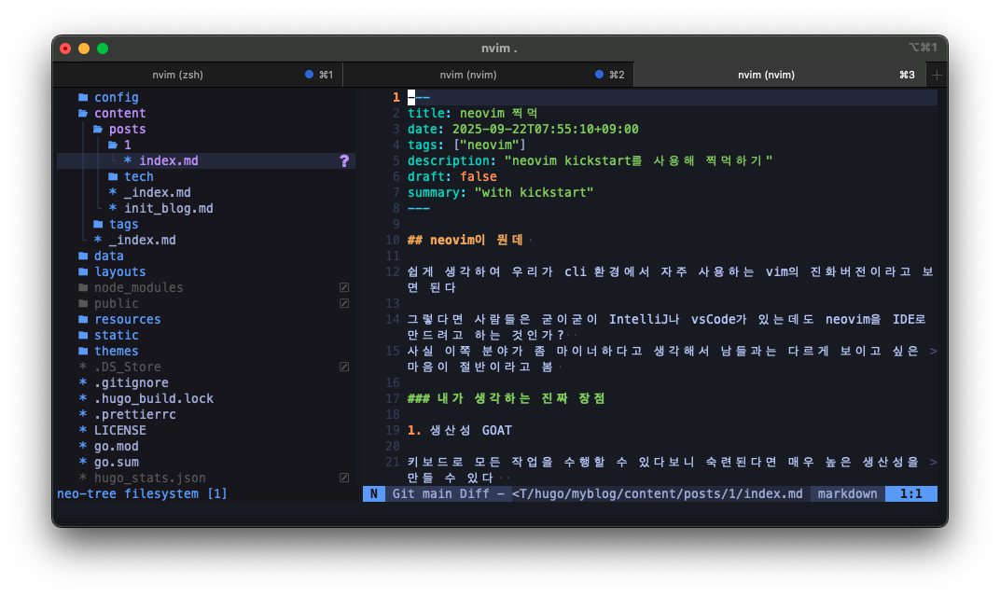
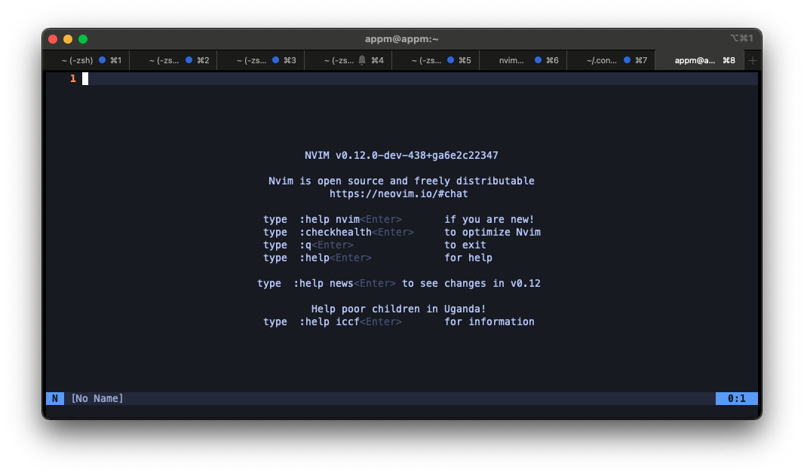

## neovim이 뭔데 



쉽게 생각하여 우리가 cli 환경에서 자주 사용하는 vim의 진화버전이라고 보면 된다

그렇다면 사람들은 굳이굳이 IntelliJ나 vsCode가 있는데도 neovim을 IDE로 사용하려는 것인가?  
사실 neovim이나 emacs나 둘다 마이너하다고 생각해서 남들과는 다르게 보이고 싶은 마음이 절반이라고 봄(개인적 생각)  

그럼에도 내가 단기간 사용해보면서 생각한 몇가지 장점들이 있다  

### 내가 생각하는 진짜 장점

1. 생산성 GOAT

키보드로 모든 작업을 수행할 수 있다보니 숙련된다면 매우 높은 생산성을 만들 수 있다  
(다른 툴도 단축키 맵핑하면 똑같은 거 아님?)

2. 이식성

똑같은 vim 설정을 가져가고 싶다면 .vimrc 를 복붙해서 사용하듯  
neovim도 똑같다. 설정파일을 그대로 가져온다면 내 맥이서든 대상 서버에서든 새로 산 맥북에서든 똑같은 환경에서 작업할 수 있다  
그리고 터미널에서 돌아가다보니 다른 IDE에 비해 가볍기도 함


단점에 대해서는 충분히 사용하고 나서 작성할 예정이다  

## neovim 시작하기

neovim을 시작하는 방법은 여러 방법이 있는데  
그중 하나인 [kickstart](https://github.com/nvim-lua/kickstart.nvim)를 사용하겠습니다  
- kickstart와 비슷한 형태로는 [lazyvim](https://www.lazyvim.org/)이 있는데 lazyvim은 당장 IDE로 사용할 수 있는 환경을 제공하는 반면 kickstart는 스타터킷의 개념입니다


``` shell
brew install neovim
git clone https://github.com/nvim-lua/kickstart.nvim.git ~/.config/nvim
```

설치 방법은 위 커맨드가 끝입니다(mac 한정)  

이후 터미널에서 `nvim`을 입력하면 


사진과 같은 화면을 보실 수 있습니다  

### kickstart 구조

``` tree
~/.config/nvim
├── doc
│   ├── kickstart.txt
│   └── tags
├── init.lua
├── lazy-lock.json
├── LICENSE.md
├── lua
│   ├── custom
│   │   └── plugins
│   └── kickstart
│       ├── health.lua
│       └── plugins # 기본 제공 플러그인 
└── README.md

```

처음 설치하게 되면 플러그인이 비활성화되어 있습니다  
```
nvim ~/.config/nvim/init.lua
```
`-- require 'kickstart` 를 검색하시면 주석된 플러그인 항목이 있습니다  
```
  -- require 'kickstart.plugins.debug',
  -- require 'kickstart.plugins.indent_line',
  -- require 'kickstart.plugins.lint',
  -- require 'kickstart.plugins.autopairs',
  -- require 'kickstart.plugins.neo-tree',
  -- require 'kickstart.plugins.gitsigns', -- adds gitsigns recommend keymaps
```

여기서 사용할 플러그인 앞에 있는 `--` 를 제거해 주세요  
다시 nvim을 실행 후 `:Lazy` 를 입력하면 설치된 플러그인을 확인할 수 있습니다 

### 커스텀 플러그인 추가  


직접 플러그인을 추가할 때는 `custom/plugins` 디렉토리를 사용합니다  

nvim 화면내에 터미널을 띄우는 [toggleterm](https://github.com/akinsho/toggleterm.nvim)을 예제로 설명하겠습니다  

``` lua
-- ~/.config/nvim/lua/custom/plugins/toogleterm.lua
return {
  {
    'akinsho/toggleterm.nvim',
    version = '*',
    config = function()
      require('toggleterm').setup {
        size = 20,
        open_mapping = [[<c-\>]],
        direction = 'horizontal',
      }
    end,
  },
}
```

플러그인을 추가했으면 `init.lua` 에서 custom plugin을 임포트하는 부분을 활성화해 주세요

``` 
-- { import = 'custom.plugins' },
```

해당 코드의 주석을 해제하면 `cusotm/plugins` 디렉토리에 있는 .lua 파일들이 임포트 됩니다 
마찬가지로 저장후 재실행하여 주세요  

이제 `Control+\` 를 통해 터미널을 띄울 수 있습니다  


