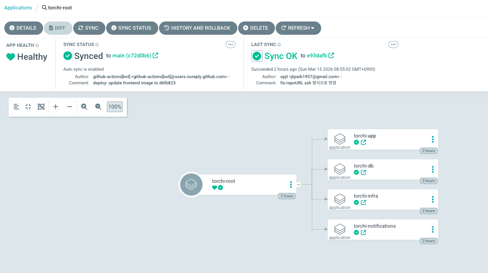
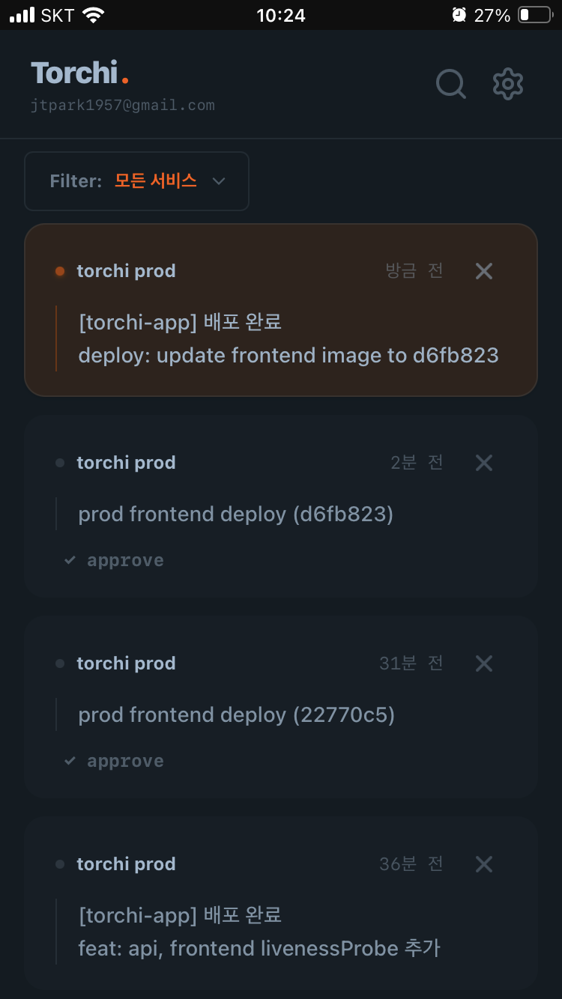

## 배포가 귀찮아졌다

사실 처음부터 거창하게 쿠버네티스(k8s)를 사용하려 했던 것은 아니었어요  
토치 규모의 서비스는 아직도 `docker compose` 만으로도 충분하다고 생각해요

하지만 개인적으로 배포가 쉽고 간편해야 **빠르게 사용해보고**,  
그만큼 빠른 피드백으로 **더 좋은 서비스가** 될 수 있다고 생각하고 있어요

그래서 스스로 이건 오버엔지니어링이다 라고 인정하면서도, k3s와 ArgoCD를 통해 GitOps를 구축하게 되었어요.

이번 글에는 ArgoCD로 구축한 GitOps 환경 위에 토치 인프라가 어떻게 구성되어 있는지 이야기 해보려 해요

> 이 글은 제가 만든 알림 서비스 `토치`를 활용하는 방법에 집중하고 있습니다.  
> 토치가 어떤 서비스인지, 왜 만들었는지 궁금하시다면 [이전글: 토치 개발기](https://opjt.github.io/posts/9/)를 먼저 읽어보시는 것을 추천드려요

## 토치쿤 사실 나도 GitOps를 해본 적이 없어· · ·

제가 관리하는 토치 인프라 레포(k8s-ssot)의 전체 구조예요.  
이름 그대로 **Single Source of Truth**(단일 진실 공급원), 즉 이 레포가 곧 서버의 현재 상태를 의미하죠.

```bash
k8s-ssot/
├── root-app.yaml # ArgoCD 진입점
├── apps/ # Application 정의
│ ├── torchi-app.yaml # API + Frontend
│ ├── torchi-db.yaml # PostgreSQL
│ ├── torchi-infra.yaml # cert-manager 등
│ └── torchi-notifications.yaml
└── manifests/ # 실제 k8s 매니페스트
├── app/
├── db/
├── infra/
└── notifications/
```

인프라의 수정사항은 모두 해당 레포를 통해서만 이루어지도록 의도했어요

### 한 번만 등록하면 끝, `App of Apps` 패턴

여기서 저는 ArgoCD의 **App of Apps** 패턴을 사용했어요, 하나의 상위 앱(root-app)이 여러 개의 하위 앱(applications)을 관리하는 구조예요.

```yaml
# root-app.yaml
spec:
  source:
    repoURL: git@github.com:opjt/torchi-infra.git
    path: apps/ # 해당 경로에 있는 어플리케이션들 등록
  syncPolicy:
    automated:
      prune: true
      selfHeal: true
```

root-app.yaml 하나만 클러스터에 등록해두면, 나머지는 ArgoCD가 알아서 처리해요.



- _torchi-root 밑에 여러 어플리케이션이 있는 모습_

`apps/` 디렉토리에 새로운 Application yaml을 추가하면 ArgoCD가 알아서 인식하고 배포해요  
반대로 파일을 삭제하면 클러스터에서도 사라지고요

### DB를 K8s에 올려도 괜찮을까요?

사실 K8s를 구축하면서 가장 많이 망설였던 부분이 바로 "DB를 쿠버네티스 안으로 가져오는 게 맞을까?" 하는 점이었어요.

쿠버네티스는 본질적으로 언제든 파드(Pod)를 죽이고 새로 만드는 **Stateless**한 환경이잖아요.  
하지만 DB는 데이터라는 상태를 유지해야 하는 **Stateful**한 성격을 지니고 있기 때문에

자칫 파드가 재시작되면서 데이터가 날아가거나, 볼륨 연결이 꼬여버리는 대참사가 일어날까 봐 걱정이 많았습니다

하지만 주변에서 이런 조언을 듣고 생각이 완전히 바뀌었어요.

> "쿠버네티스를 너무 어렵게 보지 말고 그냥 '똑똑한 스케줄러' 관점에서만 봐라. local 타입 PV를 쓰면 복잡한 외부 스토리지 설정 없이도 DB 관리하기 의외로 편하다."

쿠버네티스가 **"이 DB 파드는 데이터가 들어있는 이 노드(Local PV)에서만 띄우면 돼"**

라고 스케줄링만 해준다면, 관리 난이도는 확 내려가면서도 데이터의 안정성은 챙길 수 있게 되는 거죠.

쿠버네티스는 믿지만 사람을 믿는 것은 쉽지않아서, 언급한 것처럼 DB 전용 앱은 설정을 조금 다르게 가져갔어요.

#### DB는 안된다

```yaml
# apps/torchi-db.yaml
syncPolicy:
  automated:
    prune: false # 실수로 삭제 방지
    selfHeal: true
```

- `prune: false`면 Git에서 파일이 사라져도 클러스터의 리소스는 삭제하지 않아요
- 실수로 DB yaml을 날려도 `StatefulSet`이 살아있게 하고 싶었어요

이런 부분이 `App of Apps` 구조의 장점이기도 해요.  
ArgoCD의 syncPolicy는 App 단위로 적용되는 설계라, DB처럼 삭제에 민감한 리소스는 아예 별도 App으로 분리해두면 설정이 명확해져요.

### 배포 흐름

물론 이렇게 argoCD만 설정한다고 해서 GitOps가 완성되는 건 아니에요

지금까지 설정들이 CD(지속적 배포) 역할을 맡았더라면,  
그 앞단에서 코드를 빌드하고 배포의 트리거가 되는 CI(지속적 통합) 역할은 Github Actions가 담당하고 있어요

전체적인 흐름은 이런 느낌이에요.

1. **코드 push**: main브렌치에 push될 경우 트리거가 발동해요
2. **빌드 & 이미지 생성**: Github Actions에서 컨테이너라이징하여 이미지를 생성해요
3. **태그 지정**: 이때 이미지 태그는 커밋 SHA를 사용하여 고유하게 관리합니다.
4. **infra-repo 업데이트**: 빌드가 성공하면 인프라 레포지토리에 직접 접근하여 `kustomization.yaml` 파일의 이미지 태그를 새 커밋 SHA로 수정하고 커밋/푸시 해요
5. **ArgoCD 동기화** : 인프라 레포의 변화를 감지하여 클러스터의 파드를 업데이트해요

아래는 실제 github actions에서 사용하는 인프라 레포지토리의 이미지 태그를 업데이트 하는 부분이에요  
`kustomize edit` 명령어를 통해 이미지 태그만 쉽게 수정할 수 있어요

```yaml
- name: Update K8s Manifest
  run: |
    cd k8s-ssot/manifests/app
    kustomize edit set image opjt/torchi-frontend=opjt/torchi-frontend:${{ env.IMAGE_TAG }}

    git config --global user.name "github-actions[bot]"
    git config --global user.email "github-actions[bot]@users.noreply.github.com"
    git add .
    git commit -m "deploy: update frontend image to ${{ env.IMAGE_TAG }}"
    git push
```

이렇게 인프라 레포의 git log만 보면 언제 어떤 버전이 배포됐는지 확인 가능한 형태가 되었어요

<!-- - 97685fe deploy: update api image to b77e48d
- e93dafb deploy: update frontend image to 953de39 -->

## 배포 된거 맞나요?

GitOps를 적용하고 나서 배포 자체는 편해졌는데, 한 가지 불편한 점이 있었어요
push하고 나면 ArgoCD UI에 들어가서 sync 상태를 직접 확인해야 했거든요

배포가 잘 됐는지, 언제 끝났는지 알려주는 게 없으니
습관적으로 ArgoCD 대시보드를 열어보게 되더라고요

보통은 Slack이나 Discord로 알림을 보내는데,
저는 토치로 보내기로 했습니다

> 토치가 토치의 배포를 알려준다

ArgoCD Notifications는 webhook을 지원하고,  
토치는 **HTTP 요청 하나**로 push 알림을 보낼 수 있어요 이 둘을 연결하면 끝이에요

```yaml
# argocd-notifications-cm.yaml

# 1. 토치를 webhook 서비스로 등록
service.webhook.torchi: |
url: https://torchi.app/api/v1/push/$torchi-push-channel
headers:
  - name: Content-Type
    value: text/plain
# 2. 언제 보낼지
trigger.on-deployed: |

- when: app.status.operationState.phase in ['Succeeded']
  and app.status.health.status == 'Healthy'
  send: [deploy-message]
# 3. 뭘 보낼지
template.deploy-message: |
webhook:
torchi:
method: POST
body: |
[{{.app.metadata.name}}] 배포 완료
{{(call .repo.GetCommitMetadata .app.status.operationState.syncResult.revision).Message}}
```

sync가 성공하고 Pod이 Healthy 상태가 되면 알림을 보내요
Pod이 아직 뜨는 중이면 알림이 안 가고, 실제로 서비스가 정상 동작하는 시점에 알려주는 거죠

처음에는 단순하게 "배포 완료"만 보냈었는데
어떤 서비스가 어떤 버전으로 배포된 건지 알 수가 없더라고요

그래서 `GetCommitMetadata`로 커밋 메시지를 포함하도록 바꿨어요
이제 알림이 이렇게 와요



배포가 완료되면 어떤 커밋으로 배포됐는지 폰에서 바로 확인할 수 있게 됐어요

## 마무리하며

GitOps를 적용하고 나서 배포가 정말 편해졌어요
`kubectl` 칠 일이 거의 없어졌고, main 브렌치에 푸시만하면 바로 배포가 돼요

글의 시작에서 이번 작업이 '오버엔지니어링'이라고 말씀드렸지만, 사실 이건 **토치 프로젝트를 시작한 가장 큰 이유**이기도 해요.  
쿠버네티스를 직접 사용하며 느끼고, GitOps를 구축해 보며 '어떻게 하면 더 견고하고 좋은 서비스를 만들 수 있을까'를 몸소 체험하고 싶었거든요.

인프라가 탄탄해지고 배포에 들어가는 심리적 에너지가 줄어드니, 그 여유가 고스란히 서비스의 본질을 고민하는 시간으로 돌아오는 걸 느껴요.  
결국 기술을 공부하는 이유도, 인프라를 복잡하게 구성한 이유도, 사용자에게 더 좋은 경험을 더 빠르게 전달하기 위함이 아니었을까요?

무엇보다 이 모든 과정 속에 토치가 작은 역할들을 해내고 있다는 게 가장 재밌는 것 같아요.  
제가 만든 서비스가 다른 서비스들과 어우러져 하나의 시스템이 되는 걸 보면 나름 괜찮은 거 같아요


