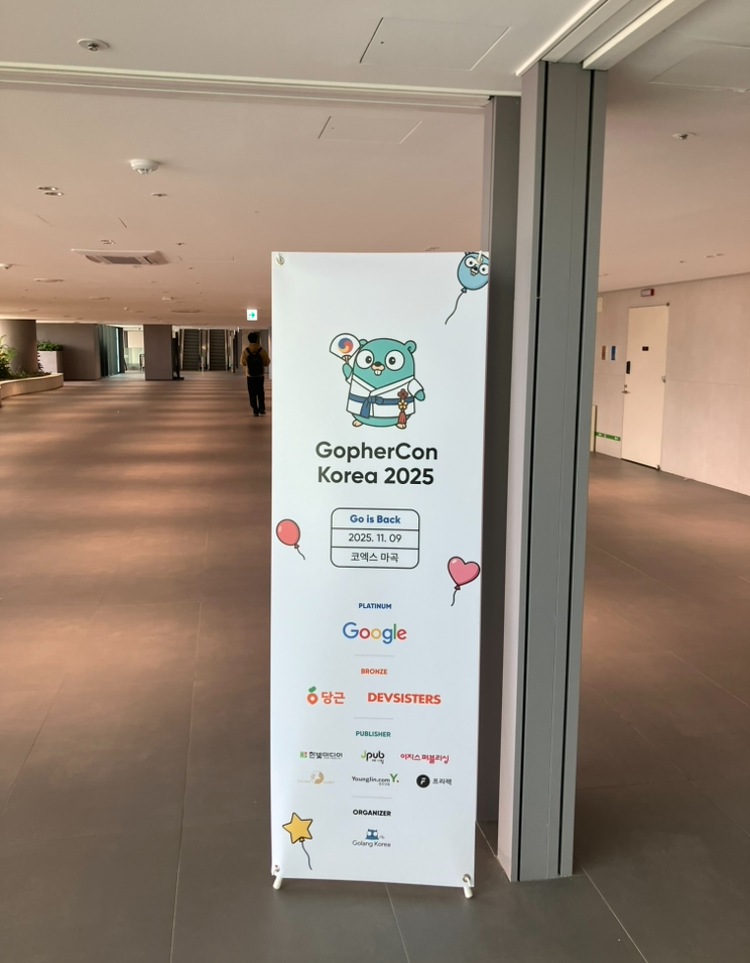

사실 티켓을 사는 것 조차 고민이 있었다  

> 아 이거 세션 영상 어차피 유튜브에 올라오는데 꼭가야할까

가격도 엄청 막 싸다고는 할 수 없었기 때문에 더 그랬을까

하지만 거리도 생각보다 가깝고, 지금 아니면 언제 가볼까 싶은 마음
그리고 새로운 자극을 받을 수 있지 않을까 싶은 생각이 가장 컸다

장소: 코엑스 마곡 4층 르웨스트홀B
`귀엽게 반겨주는 고퍼`

체크인 후 굿즈(스티커, 프린팅옷, 물)를 받은 뒤 바로 홀로 들어갔다

- 세션외에도 후원사 부스, 포토부스, 굿즈판매이 있었는데 참여하지는 않았다

11시부터 18시까지 동안 세션을 듣는 다는 것이(물론 점심,쉬는시간 있음) 생각보다 쉽지 않을 줄 알았는데  
세션을 듣다보니 시간이 훅훅 가버리더라

솔직히 모든 세션의 내용을 이해한 것은 아니다 블록체인 쪽은 배경지식이 부족해서 집중이 되진 않았다  
하지만 생각 외로 많은 자극들을 느낄 수 있었던 것이  

많은 사람들 앞에서 발표하는 모습(나도저렇게pt하고싶다),  
좋아하는 언어 하나로 100명 넘게 모인 사람들,  
그리고 나는 아직 Go를 Go스럽게 쓰지 못하고 있다는 걸 느꼈다.

올까말까 고민했던 나지만, 어쩌다 보니 클로징할 때까지 남아있게 되었고 운이좋게 경품(텀블러)도 받게 되었다(사실 뱃지 받고싶었음)  
첨엔 티켓값이 아깝다고 생각이 들었지만 집에 와서 다시 생각하니 하나도 아깝지가 않다

이 컨퍼런스에 참여하기 위해 부산에서 까지 올라오신 분도 계셨는데 그분들은 얼마나 더 go에 진심이신 걸까,,

만약 고퍼콘을 갈까말까 고민하다 서칭해서 이 글을 보게 되셨다면, 한번 가보십쇼 라고 전하고 싶다  
