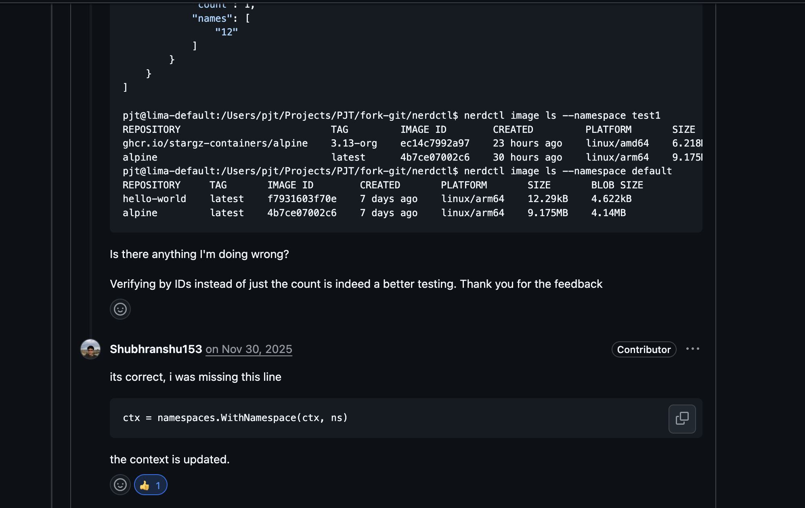
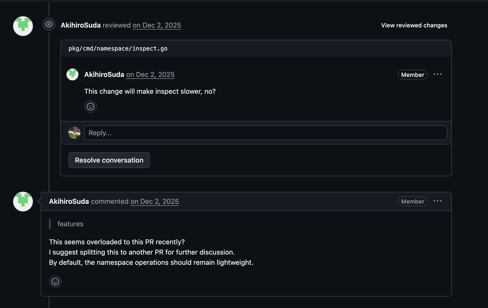

사실 거창한 기여를 한 건 아니다. 하지만 "첫" 기여라는 점에서, 이 경험은 꼭 한 번 기록으로 남기고 싶었다.

기여한 지는 좀 됐는데, 릴리즈되기 전까지는 혹시 모를 상황이 있을까 봐 글 쓰는 걸 미루고 있었다.

## nerdctl을 아시나요

아는 사람도 있겠지만, 나는 기여하기 전까지는 [nerdctl](https://github.com/containerd/nerdctl)을 잘 몰랐다.

간단히 말하면 `docker`를 쓰지 않고 `containerd`와 직접 통신하기 위해 사용하는 CLI 도구라고 보면 된다.

평소에 CNCF나 컨테이너 기반 시스템에 관심이 많아서, 언젠가는 클라우드 생태계의 오픈소스에 꼭 한 번 기여해보고 싶다는 생각을 하고하고있었다.

마음 같아선 [containerd](https://github.com/containerd/containerd)에 기여하고 싶었지만,,,  
솔직히 말해 그건 아직 나한테 너무 높은 산처럼 느껴졌다.

그러다 `nerdctl`을 보게 됐는데, 오픈소스 초보자를 위한 `good first issue` 태그가 잘 정리돼 있었다.

> 아 이거다.

(Thank you, nerdctl team!)

## 제가 해도 될까요?

첫 오픈소스 기여다 보니, 이슈를 고르고 작업에 이르기까지 조차 쉽지 않았다.

그러다 눈에 들어온 이슈가 있었는데,

[#3851](https://github.com/containerd/nerdctl/issues/3851) <-- 이슈 포착

`goot first issue` 태그가 달린 것 중에 할당이 안된 이슈를 찾고 어느정도 사이즈가 나오면  
정중히 여쭤봅니다.

챗 지피티님. 제가 이 이슈를 작업할 수 있게 도와주세요.

이후 이슈에 코멘트를 달고 Assignees에 매핑된 걸 확인하고 나서야 작업을 시작했다

## 첫 PR

nerdctl에는 docker와는 다르게 namespace라는 개념이 있다
기존 namespace 명령어에 유효성 체크하는 로직들이 부족하여

- 특정 플래그(--label) 필수로 지정하도록 수정
- update 명령어 실행 시 namespace 존재하는지 체크 등

그리고 namespace inspect 명령어 부분에서 namespace에 속한 리소스 정보들을 포함하도록 개선하였다

[PR#4618](https://github.com/containerd/nerdctl/pull/4618)

올리고 며칠 기다리니 리뷰어님의 폭풍 피드백을 받게 됐다.
좋은 피드백도 있었지만, 내 코드를 제대로 보지 않고 한 피드백도 있어 당시에는 이해가 되지 않았다.

(내가 기존 코드를 잘 못 이해했나 싶어서 몇시간을 뒤적이던게 생각난다)

(지금 다시 보면 웃기지만, 서로가 서로를 답답해하고있다는 게 느껴진다)

그래도 다행히 이야기를 계속 나누다 보니, 결국 리뷰어 분도 본인이 잘못 본 부분이 있었다는 걸 인정해 주셨다.

다만 이 과정에서 시간을 가장 많이 쏟았던 부분(`inspect` 명령어에서 리소스 정보를 추가한 변경 사항)은 아쉽게도 이번 PR에서는 제외됐다.

이유는 명확했다. 이 변경이 `inspect` 커맨드를 너무 무겁게 만든다는 메인테이너님의 판단이었다.
솔직히 맞는 말이기도 하고, 무엇보다 AI에 지배당하는 내 영어 실력으로는 끝까지 설득할 자신이 없었다.

그래서 미련없이 PR을 닫고 유효성 검증 로직만 깔끔하게 정리해서 다시 PR을 올렸다.

[PR#4631](https://github.com/containerd/nerdctl/pull/4631)

새로 올린 PR은 누가봐도 논란의 여지가 없었고 너무 간단한 부분들이었기에 별 탈 없이 승인이 되었다.

## 마치며

조금의 우여곡절이 있었지만  
`Merged`의 보랏빛 아이콘이 주는 쾌감은 나름 좋았다

첫 기여를 하며 느꼈던 점은, 오픈소스 기여는 단순히 코드만 잘 짠닥 되는 게 아니라는 점이다.
메인테이너와 기존 기여자들이 어떤 의도로 코드를 작성했는지 이해해야 하고, 내가 왜 이런 변경을 했는지를 설명할 수 있어야 하며,  
때로는 적당히 타협할 줄 아는 커뮤니케이션 능력도 정말 중요했다.

생각해 보면 회사에서 일하는 것과 크게 다르지 않다. 그래서 왜 오픈소스 기여 경험을 중요하게 보는지도 조금은 알 것 같았다.

내가 nerdctl을 처음부터 만든 것은 아니지만,  
이제 어딘가 내 코드 한 줄이 섞여 있다는 사실만으로 우쭐해지게 되는 이 기분은 나름 나쁘지 않은 것 같다

아마 이런 감정 때문에 사람들이 오픈소스를 하는 게 아닐까 싶다.

내가 좋아하는 분야를 다른 사람들과 함께 만들어 가고, 내가 만든 코드가 누군가에게 실제로 쓰이고, 그 과정에서 느끼는 작은 성취감.

이번 경험을 시작으로, 앞으로는 더 많은 프로젝트와 컨테이너 생태계에 계속해서 기여해보고 싶다.  
(그러기 위핸 영어 공부를 해야하지 않을까 싶다.)
