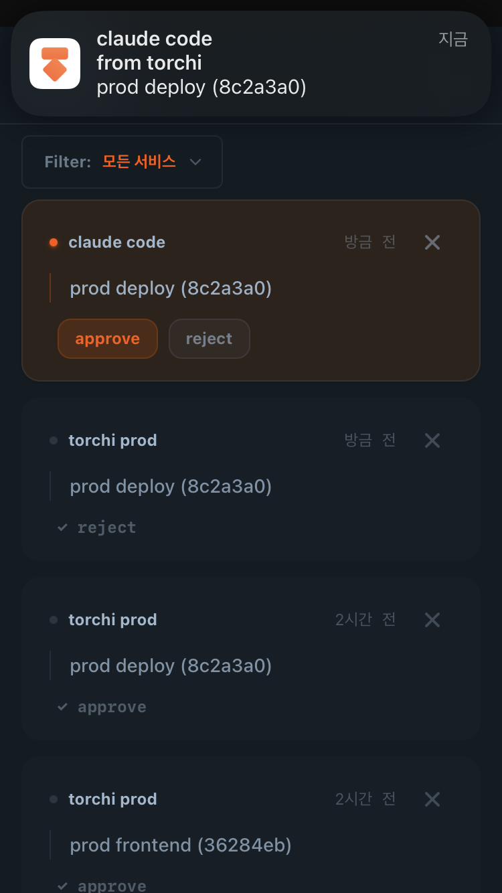
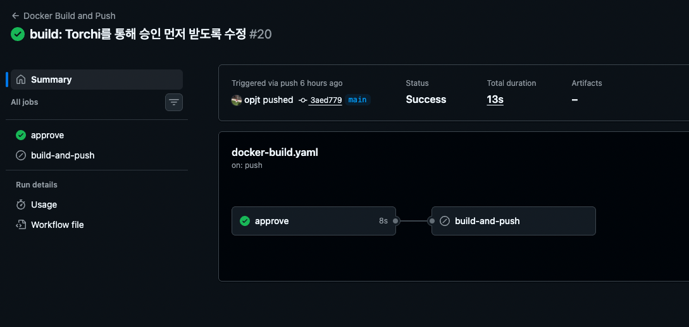

## 또 웹서비스야?

또 또 또 웹서비스를 만들고 싶었던 건 아니에요  
가장 큰 이유는 두가지가 있는데,

1. 개인 관심사인 k8s 생태계에 익숙해지기 위해 운영할 서비스가 필요
2. 웹서비스가 아닌 다른 종류의 서비스도 개발해보고 싶었기 때문

크롤링 시스템이든 자동화 워크플로우 든 간에 결과를 받을 창구가 필요했어요  
웹은 하고 싶진 않았지만, 쓰기 편하고 인터페이스가 간단하다는 건 부정할 수 없었어요  
그래서 결국 나만의 알림 서비스를 만들기로 했습니다

슬랙이나 디스코드 같은 메신저 서비스에 얹을 수도 있겠지만, 원하는 기능들을 맘대로 추가하기엔 제한들이 있었기에 직접 만들게 되었습니다

토치 바로가기 -> <https://torchi.app>

## 토치가 뭔데?

토치(Torchi)는 **엔드포인트 기반 push 알림 서비스**예요.

HTTP 요청 하나로 내 폰에 알림을 보낼 수 있어요.

```bash
curl "https://torchi.app/api/v1/push/7VMorfkaBM0" -d '배포 완료'
```

근데 단순히 알림만 보내고 받는 것은 다른 서비스에서도 그대로 제공하는 기능이었어요 (ntfy.sh 등등)

그래서 토치는 알림에 **수락 / 거절**과 같은 액션을 붙일 수 있어요

```bash
reaction=$(curl -s "https://torchi.app/api/v1/push/7VMorfkaBM0/ask" \
  -d 'msg=프로덕션 배포할까요?'  -d 'actions=승인,거절')

if [ "$reaction" = "승인" ]; then
  ./deploy.sh
fi
```

위는 토치를 활용한 간단한 워크플로우 형태에요  
자동화 워크플로우가 나한테 물어보고, 내가 답하면 다음 단계가 실행되는 구조예요.

이 때부터 토치가 단순 알림시스템이 아니라  
**나와 시스템**이 대화가 되는 서비스가 되어야 겠다고 느꼈어요

요즘 AI를 활용한 자동화 시스템을 많이 구축하잖아요?  
그런 곳에서도 토치를 활용해서 **Human-in-the-Loop** 개입이 될 수 있지 않을까 생각이들어요

## 나부터 쓴다 dogfooding

토치를 디자인할 때, 다른 유저의 편의성도 있겠지만 일단 내가 먼저 쓰기 편해야 겠다고 생각했어요  
그리고 내가 직접 쓰냐는 거 이기도 했구요

토치의 배포 파이프라인에도 토치가 쓰이고 있는데요.

> 현재 torchi의 배포 시스템은 GitOps로 구축되어 있어, main 브렌치에 푸시되면 prod에 배포되고 있어요

main 브렌치에 푸시되면 Github Actions가 돌면서, 토치의 `/ask` api로 먼저 저에게 물어봐요.



그러면 제 폰에 알림이 오게되고 승인 버튼을 누르면 이후 jobs 들이 실행돼요  
거절을 누르거나 시간안에 버튼을 누르지 못할 경우 파이프라인은 거기서 멈춰요.



> 실제 github workflow는 [여기](https://github.com/opjt/torchi/blob/v0.1.0/.github/workflows/docker-build.yaml#L27)서 확인할 수 있어요

자동화는 하되, 결정은 사람이 개입하게 되는 거죠.  
토치를 쓰는 가장 대표적인 이유예요

## 마무리

토치는 거창한 아이디어가 있었던 게 아니라,  
누구나 생각할 수 있는 아이디어를 '내가 불편해서, 나에게 맞게' 구현한 서비스예요

요즘 AI 발전으로 SaaS 제품들이 설 자리를 잃어가고 있는 것 같아요
AI로 금방 자기만의 스타일로 만들면 되니까요, 토치도 하루이틀이면 만들 수 있을 거예요.

근데 제가 필요한 기능들을 생각하고, 불편과 필요의 의해 만든 거라 다른 서비스와는 애착이 달라지게 된 것 같아요
AI가 비슷한 걸 뚝딱 만들어줄 수는 있어도, 제가 만들었다는 건 바뀌지 않으니까요.
이 서비스를 개발하면서 했던 고민들과 경험은 대신해줄 수 없지 않을까요?

제가 쓸 게 없어서 만든 거라  
기준이 명확하고, 피드백도 빨라서(= 내가 바로 씀) 금방금방 만들 수 있었던 것 같아요  
(사실 로고 만드는 데 시간이 가장 많이 든것 같아요😅)

아직 부족한 부분도 많고, 해결해야 될 문제와 다듬어야 할 것도 많지만

- 다중 디바이스에서 알림처리
- 멀티노드에서 SSE 처리 등

일단 저는 매일 쓰고 있고. 그걸로 충분한 시작이라고 생각해요.


